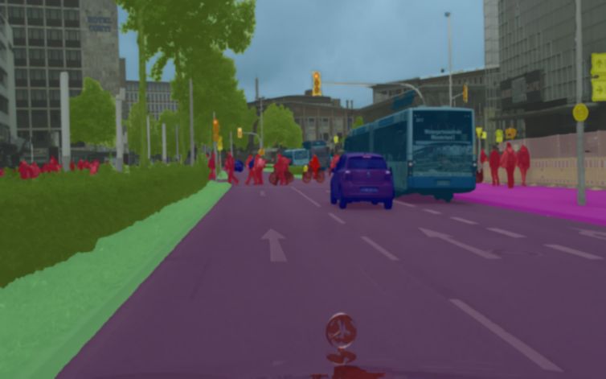
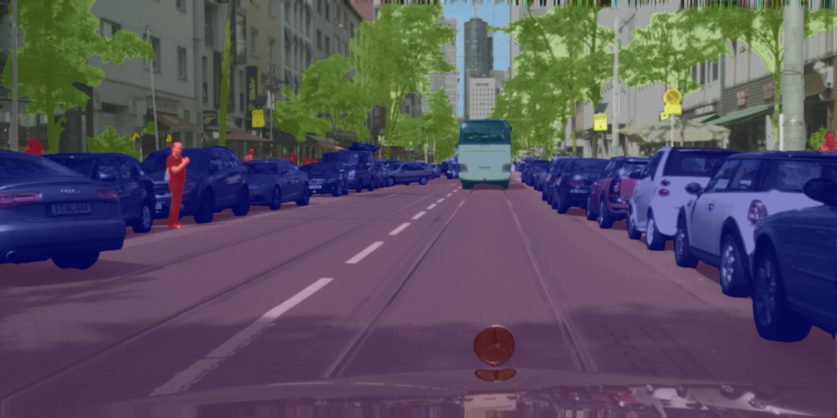
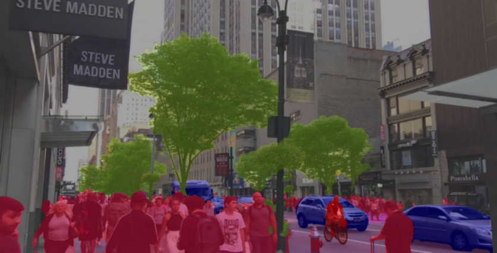

# Swin-S Unet with multiple Losses in Cityscapes Dataset 🚀️


### * 如果您使用了本代码，可以点击🌟或Fork给予我鼓励!谢谢！🙏
*  


### * [效果预览 🎉️](demo/)
 
 


### * [环境配置 🎉️](docs/get_started.md)

* 环境安装

  ```bash
  pip install requirements.txt
  ```

  或者

  ```bash
  conda create --name <env> --file requirements.txt
  ```

### * [数据集下载与预处理 🎉️](docs/dataset_prepare.md)

1. 首先创建数据集目录文件夹与设置目录文件

```shell
export PROJECT=$(pwd)
mkdir "$PROJECT/data"
mkdir "$PROJECT/data/cityscapes"
```

2. Cityscapes数据集可以在 [这里](https://www.cityscapes-dataset.com/downloads/) 下载。本项目使用的 [训练集](https://www.cityscapes-dataset.com/file-handling/?packageID=3) 和 [标签](https://www.cityscapes-dataset.com/file-handling/?packageID=1)
3. 下载完成后解压数据集

```shell
unzip gtFine_trainvaltest.zip "gtFine" -d $PROJECT/data/cityscapes
unzip leftImg8bit_trainvaltest.zip "leftImg8bit" -d $PROJECT/data/cityscapes
```

4. 在数据集下载完成后基于[cityscapesscripts](cityscapesscripts)去选择所需训练的类别，在[这里](cityscapesscripts/helpers/labels.py)设置（本项目使用19类
5. 设置完训练类别后，运行

```shell
export CITYSCAPES_DATASET=data/cityscapes/
python cityscapesscripts/preparation/createTrainIdInstanceImgs.py
```

4. 使用此 [脚本](https://github.com/open-mmlab/mmsegmentation/blob/master/tools/convert_datasets/cityscapes.py) ,去生成 `**labelTrainIds.png`。

```shell
# --nproc 8 意味着有 8 个进程用来转换，它也可以被忽略。
python tools/convert_datasets/cityscapes.py data/cityscapes --nproc 8
```

### * [设计网络 🎉️](docs/config_model.md)

* 本项目使用的是Swin-Unet
  * 单损失函数配置在 [这里](upernet_swin_small_patch4_window7_512x512_320000_cityscape.py)
  * 多损失函数配置在 [这里](upernet_swin_small_patch4_window7_512x512_320000_multiple_loss_cityscape.py)

### * [开始训练 🎉️](docs/train.md)

* 预训练模型在 [这里](https://github.com/SwinTransformer/storage/releases/download/v1.0.0/swin_small_patch4_window7_224.pth) 下载
* ```shell
  cd $PROJECT/
  mkdir pretrain
  wget https://github.com/SwinTransformer/storage/releases/download/v1.0.0/swin_small_patch4_window7_224.pth
  python tools/model_converters/swin2mmseg.py swin_small_patch4_window7_224.pth pretrain/swin_small_patch4_window7_224.pth
  rm swin_small_patch4_window7_224.pth
  python tools/train.py upernet_swin_small_patch4_window7_512x512_320000_multiple_loss_cityscape.py --gpu-ids 0
  ```
  
### * [权重下载 🎉️](https://github.com/XuHahn/swin_unet_mmseg/releases/)

#### * iter192000:
  | iter | mIoU | mAcc | 下载 |
  | ----- | ----- | ----- | -----|
  | 192000 | 80.34 | 86.99 | [⏬](https://github.com/XuHahn/swin_unet_mmseg/releases/tag/iter192000-miou80.34) |

  |     Class     |  IoU  |  Acc  |     Class     |  IoU  |  Acc  |
  |---------------|-------|-------|---------------|-------|-------|
  |      road     | 98.23 | 99.35 |      sky      | 95.34 | 98.45 |
  |    sidewalk   | 85.71 | 91.15 |     person    | 83.96 | 90.81 |
  |    building   | 92.92 | 96.99 |     rider     | 66.24 | 79.68 |
  |      wall     | 61.53 | 68.19 |      car      | 95.67 | 97.72 |
  |     fence     | 61.19 |  69.6 |     truck     | 84.17 | 89.94 |
  |      pole     | 66.97 | 77.55 |      bus      | 91.95 | 94.47 |
  | traffic light | 73.88 | 83.43 |     train     | 84.71 | 89.64 |
  |  traffic sign | 80.71 | 85.94 |   motorcycle  | 69.27 | 77.15 |
  |   vegetation  | 92.86 | 96.61 |    bicycle    | 74.55 | 91.92 |
  |    terrain    | 66.61 | 74.14 |    average    | 80.34 | 86.99 |


### * [验证 🎉️](docs/inference.md)

* ```shell
  python tools/test.py upernet_swin_small_patch4_window7_512x512_320000_multiple_loss_cityscape.py  work_dirs/iter_192000.pth --eval mIoU cityscapes
  ```

### * [其他工具 🎉️](docs/useful_tools.md)
